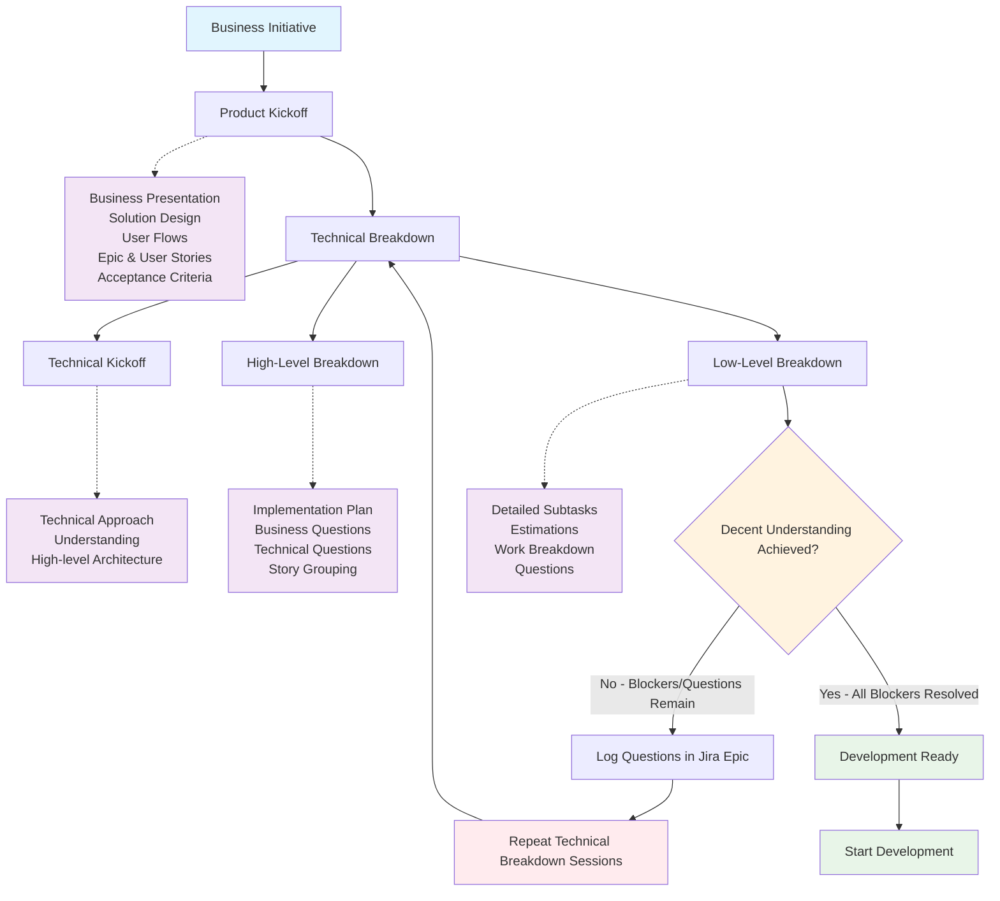

## Overview

The goal of this activity is to build comprehensive knowledge about upcoming initiative. Team needs to define external dependencies, technical blockers, work sequence, components dependencies, product blockers and questions.

## Process Flow

## Process Details

#### Kickoff Meeting

Team meeting is organized for upcoming business initiative. Stakeholder(s) presents the initiative (feature). Describe the business side of it. Then solution is presented in form of presentation, design, user flows, mockups.

**Product Kickoff Artifacts:**

| Artifact Type | Description | Format |
|---------------|-------------|---------|
| Business Presentation | Overview of the initiative from business perspective | Slides/Deck |
| Solution Design | Visual representation of the proposed solution | Design files, mockups |
| User Flows | Step-by-step user interaction flows | Flowcharts, wireframes |
| Epic & User Stories | Detailed requirements broken down into user stories | Jira Epic with linked stories |
| Acceptance Criteria | Clear definition of what constitutes completion | Text within user stories |

#### Technical Breakdown Meetings

| Phases               | Description | Outputs | Work Breakdown |
|----------------------|-------------|---------|----------------|
| Technical Kickoff    | If available, CTO or other team member describes high level technical solution to the team | Technical approach understanding | High-level architecture and approach |
| High-Level Breakdown | Team decides how to group user stories so that the feature can be developed and delivered in small chunks. Whiteboard software is used to illustrate work order and dependencies. | • High-level Implementation plan • Business Questions • Technical Questions | User story grouping and sequencing |
| Low-Level Breakdown  | Deep Dive into each User Story. Each story is broken down into small pieces. | • Business Questions • Technical Questions • Detailed subtasks with estimations | • Endpoint • Business Logic • Design • UI Component • Test Cases (smoke) |

## Important Rules

- After each session, questions and answers should be logged into Jira Epic as comment or description. Jira is our source of truth.
- After Breakdown Meeting team creates corresponding subtasks with estimations under corresponding user stories.
- Team can start the development only after they got decent understanding of the feature and elimination of all blockers and questions.

## Tools

**Jira** - We use Epics as source of truth. All questions, adjustments should be logged there.

**Lucid** - Breakdown sessions are happening in the whiteboard.

## Examples

Below are visual examples of how breakdown sessions are conducted:

### Story Grouping Example
This example shows how user stories are grouped and sequenced during high-level breakdown sessions:

### Technical Breakdown Example  
This example demonstrates the detailed breakdown process showing task decomposition and dependencies:

