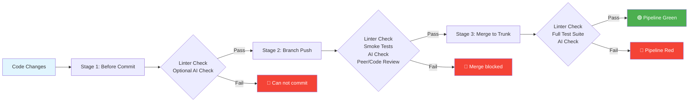

## Overview

This document illustrates the initial setup for deployment pipeline. Upgrades will follow, but for now we need to focus on basic things.

## Pipeline Stages

| Stage | Checks | Requirements                                                             |
|-------|--------|--------------------------------------------------------------------------|
| **Local Code Commit** | • Linter Check • Optional AI Check | Developer verification                                                   |
| **Feature Branch Push** | • Linter Check • Smoke Test Suite • AI Check | Automated validation                                                     |
| **Feature Branch Merge** | • Linter Check • Full Test Suite • AI Check | • 1 approval required • Code review completed  • Peer Review Completed |

## Process Flow

