## Overview

This document illustrates the initial setup for deployment pipeline. Upgrades will follow, but for now we need to focus on basic things.

## Pipeline Stages

| Stage | Checks | Requirements                                                             |
|-------|--------|--------------------------------------------------------------------------|
| **Local Code Commit** | • Linter Check • Optional AI Check | Developer verification                                                   |
| **Feature Branch Push** | • Linter Check • Smoke Test Suite • AI Check | Automated validation                                                     |
| **Feature Branch Merge** | • Linter Check • Full Test Suite • AI Check | • 1 approval required • Code review completed  • Peer Review Completed |

## Process Flow

```mermaid
graph LR
    A[Code Changes] --> B[Stage 1: Before Commit]
    B --> C{Linter Check<br/>Optional AI Check}
    C -->|Pass| D[Stage 2: Branch Push]
    C -->|Fail| E[🔴 Can not commit]
    
    D --> F{Linter Check<br/>Smoke Tests<br/>AI Check <br/> Peer/Code Review}
    F -->|Pass| G[Stage 3: Merge to Trunk]
    F -->|Fail| H[🔴 Merge blocked]
    
    G --> I{Linter Check<br/>Full Test Suite<br/>AI Check}
    I -->|Pass| J[🟢 Pipeline Green]
    I -->|Fail| K[🔴 Pipeline Red]
    
    style A fill:#e1f5fe
    style J fill:#4caf50,color:#fff
    style E fill:#f44336,color:#fff
    style H fill:#f44336,color:#fff
    style K fill:#f44336,color:#fff
```

