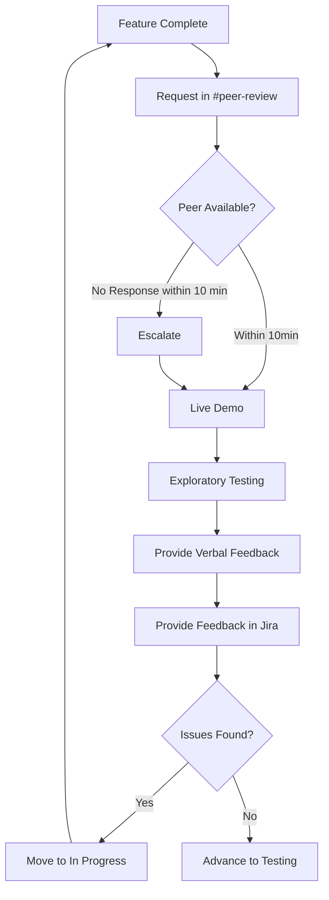

> **"Does this new feature work and feel right?"**

# Introduction

A Peer Review is a crucial quality step that happens after the code is written, but before it gets formally tested or released. It's an interactive session where an engineer gives a live demo of the new functionality to a peer. This isn't a passive presentation; it's a hands-on, exploratory session designed to answer this central question.
Think of it as the first time the feature is seen through a fresh pair of eyes. While a Code Review checks that the code itself is well-written, secure, and efficient (e.g., no obvious mistakes like nested loops or excessive API calls), a Peer Review checks that the feature behaves as expected from a user's perspective. The goal is to get fast, informal feedback and catch obvious bugs, performance issues, design inconsistencies, or confusing user experiences before the feature moves to the next stage.

**Key Benefits:**
- **Waste Prevention**: Catch obvious bugs and UI issues early
- **Testing Efficiency**: Formal testing receives polished features
- **Progress Transparency**: Clear picture of actual completion status
- **Knowledge Sharing**: Spread functionality awareness across team

# Process Overview

**Step by Step:**
- **Initiation**
  - **Developer**: Completes feature development and creates thread in `#peer-review` channel with feature details
  - **Peer**: Responds with checkbox emoji (✅) or message under thread to claim the review
- **Demo**
  - **Developer**: Walks through functionality in local environment, focusing on user experience, not code implementation details
  - **Peer**: Observes and asks clarifying questions during demo
- **Exploratory Testing**
  - **Peer**: Acts as inquisitive user testing the feature and asks "What if..." questions to explore edge cases
- **Feedback**
  - **Peer**: Provides immediate verbal feedback during session
  - **Peer**: Documents findings and feedback in Jira ticket comments
  - **Developer**: Moves ticket to next stage or back to In Progress based on results

  
**Core Rules**
  - **10-minute response rule**: Team goals over individual goals
  - **No shortcuts**: Process cannot be bypassed
  - **Complete features only**: Respect peers' time

## Don'ts
{:.no_toc}

- **Being unprepared to demo**: Developer should have the feature ready to demonstrate with proper test data and environment setup
- **Peer not reading User Stories before joining the call**: Peer should review the relevant User Stories and requirements beforehand to provide meaningful feedback

## FAQ
{:.no_toc}

**Does peer review replace code review?**  
No. Peer review complements code review - they serve different purposes. Code review checks implementation quality (security, efficiency, code standards), while peer review validates user experience and functionality.

**What comes first, peer review or code review?**  
To simplify the process, it doesn't matter.

**Can one person do both peer review and code review?**  
Yes. The same person can perform both types of reviews, as long as they approach each with the appropriate mindset - technical implementation for code review, user experience for peer review.

## Slack Channel Example

Below is an example of how the peer review request and response process looks in the `#peer-review` Slack channel:

