## Overview

Pull-Based Workflow transforms how teams approach task assignment by shifting from coordinator-driven assignments to team member self-selection based on capacity and expertise. Instead of waiting for work to be assigned, team members proactively pull tasks from the backlog when they have capacity.

> ##### WARNING
>
> This approach will break workload distribution table in Jira as tasks in backlog are unassigned. Instead, we should use overviews using components + fix versions to get valid overview.
{: .block-danger }

## Push-Based vs Pull-Based

| Push-Based (Current) | Pull-Based (Future) |
|---------------------|---------------------|
| ❌ **Reduced Ownership** - Less investment in tasks that are imposed rather than chosen | ✅ **Higher ownership** - Greater investment in self-selected work |
| ❌ **Risk of Inefficient Allocation** - Skills and interests not optimally matched to tasks | ✅ **Improved skill utilization** - Members can choose tasks matching their expertise |
| ❌ **Unnecessary Ceremony** - Coordination takes a significant efforts and time | ✅ **Reduced bottlenecks** - No dependency on coordinator availability |
| ❌ **Context Switching** - Members interrupted with assignments regardless of current focus | ✅ **Increased autonomy** - Team and Team members have control over their work selection |

## Process Comparison

```mermaid
flowchart TD
    subgraph Future["🎯 FUTURE: Pull-Based Selection"]
        A2[Prioritized Backlog] --> B2[Team Members Monitor]
        B2 --> C2{Available Capacity?}
        C2 -->|Yes| D4[Select Task Based On:]
        D4 --> E4[• Skills Match<br/>• Interest<br/>• Priority<br/>• Dependencies]
        E4 --> F2[Pull Task & Start Work]
        C2 -->|No| G2[Continue Current Task]
        F2 --> H2[Complete & Pull Next]
    end
    
    subgraph Current["📋 CURRENT: Push-Based Assignment"]
        A1[Work Backlog] --> B1[Team Coordinator]
        B1 --> C1[Assigns Task]
        C1 --> D1[Team Member 1]
        C1 --> D2[Team Member 2]
        C1 --> D3[Team Member 3]
        D1 --> E1[Works on Assigned Task]
        D2 --> E2[Works on Assigned Task]
        D3 --> E3[Works on Assigned Task]
    end
    
    style Current fill:#ffebee
    style Future fill:#e8f5e8
    style A1 fill:#ffcdd2
    style B1 fill:#ffcdd2
    style A2 fill:#c8e6c8
    style B2 fill:#c8e6c8
    style F2 fill:#c8e6c8
```

## Task Pull Process

```mermaid
flowchart TD
    subgraph Scenario1["🔥 Critical Tasks Present"]
        A1[Task #1 🔥] --> B1[Task #2 🔥]
        B1 --> C1[Task #3]
        C1 --> D1[Task #4 - Knowledge Area]
        D1 --> E1[Task #5]
        
        F1[Developer Available] --> G1{Critical Tasks?}
        G1 -->|Yes| H1[Must Pick Task #1]
        H1 --> I1[Work on Critical Task]
        
        style A1 fill:#ffcdd2
        style B1 fill:#ffcdd2
        style H1 fill:#ffcdd2
        style I1 fill:#ffcdd2
    end
    
    subgraph Scenario2["✅ Normal Selection"]
        A2[Task #1] --> B2[Task #2]
        B2 --> C2[Task #3]
        C2 --> D2[Task #4 - Knowledge Area]
        D2 --> E2[Task #5]
        
        F2[Developer Available] --> G2{Knowledge Area?}
        G2 -->|Task #4 matches| H2[Pick Task #4]
        H2 --> I2[Work on Selected Task]
        
        style D2 fill:#c8e6c8
        style H2 fill:#c8e6c8
        style I2 fill:#c8e6c8
    end
    
    style Scenario1 fill:#ffeaa7
    style Scenario2 fill:#dff0d8
```

## Benefits

✅ **Improved skill utilization** - Members can choose tasks matching their expertise  
✅ **Increased engagement** - Freedom to choose interesting and challenging work  
✅ **Increased autonomy** - Team and Team members have control over their work selection  
✅ **Higher ownership** - Greater investment in self-selected work  
✅ **Reduced bottlenecks** - No dependency on coordinator availability  

## Implementation Guidelines

### 1. Backlog Preparation
- Maintain a well-prioritized, visible backlog
- Backlog is groomed on demand by the team

### 2. Team Process
- **Daily standup**: Share capacity and next task intentions
- **Collaboration**: Coordinate with the team regularly on tasks allocation

### 3. Capacity Management
- Limit work-in-progress per team member to 1 - 2
- Pull new work only when current tasks near completion
- Consider context switching costs when selecting tasks
- Balance Product Work with Technical Debt tasks (Requires time allocation for technical debt)

### 4. Unplanned Work
Preferably, unplanned work should go to backlog as the highest priority, so that when the next developer is free it will be picked up. Otherwise, if that is critical, it is allowed to interrupt the developer.

> ##### Interruption
>
> Interruption has a cost. It should be an exception, not routine.
{: .block-danger }

## FAQ

**How do we handle unplanned or critical assignments?**  
Intervention is allowed for critical work. See section 4. Unplanned Work above for the proper process.

**What if the task matching my expertise is #4 in the priority list?**  
Pick #4 unless there are blockers or critical tasks before it that need to be resolved first.

**How do we coordinate work allocation planning?**  
Hold a short and simple call with the team. Decide who is working on what collaboratively with the team.

## Best Practices

- **Clear priorities**: Maintain backlog ordering to guide selection
- **Transparent communication**: Keep team informed of selections and progress
- **Flexibility**: Allow coordinator intervention for urgent or critical items