```mermaid
mindmap
  root((24 Capabilities))
    🎯 Continuous Delivery
      Version Control
      Deployment Automation
      🎯 Continuous Integration
      Trunk-based Development
      🎯 Test Automation
      Test Data Management
      Shift Left Security
    🎯 Architecture
      🎯 Loosely Coupled Architecture
      Empowered Teams
    Product & Process
      Customer Feedback
      Value Stream
      Working in Small Batches
      Team Experimentation
    Lean Management
      Change Approval Process
      Monitoring
      Proactive Notification
      WIP Limits
      Visualizing Work
    Culture
      Westrum Organizational Culture
      Support Learning
      Collaboration Among Teams
      Job Satisfaction
      Transformational Leadership
```

## Intro

Transformation takes a lot of efforts and time and we need to tackle the most critical challenges. Our approach focuses
on 24 key capabilities across five major areas:

## Improvement Areas

We have developed a strategic plan for the first phase of our transformation journey. This initial phase focuses on
establishing the foundational capabilities that will enable subsequent improvements across all areas. The plan
prioritizes high-impact, achievable changes that create momentum for the broader transformation effort.

### Tests Automation

##### Test Development

Tests are developed together with features and executed in feature branches before merge and after merge to test branch.
Developers are responsible for developing, maintaining, and operating tests.

##### Existing Tests Migration

Existing tests will be gradually migrated by the frontend team with assistance from Illia under Andreea's coordination.
We will select only high-value tests to ensure we reduce each regression phase effectively.

### Frontend Improvements

##### TypeScript Integration

We are integrating TypeScript to improve quality and catch bugs at build time. New features are developed with
TypeScript only. When developing features, we also take time to cover code/features with strong types that are
dependencies to the feature. Our main goal is to cover API endpoints, Redux state, and components.

##### Linters

We take care of linters by initially eliminating all errors from ESLint and introducing new rules if needed. After that,
we enable linter checks on commit (using Husky or other tools) to ensure code with linter warnings cannot be committed.
TSLinter must also be implemented.

##### Module-based Project Structure

We are moving towards a module-based structure where features are encapsulated in single folders. Each module has UI,
API calls, and states. We introduce strict rules on code reuse and communication between modules. We expect this
approach to reduce dependency chaos. This structure also helps AI work with the code more efficiently.

### Processes

##### Breakdown Sessions

Before each feature, we hold breakdown sessions ([reference to process page](../processes/breakdown-sessions/)) with the
entire team to better understand the scope of work. During Q4, we improve this process to tailor it for team needs.

##### Peer Review

We run peer review for each pull request to improve quality of
work. [Reference to the process page](../processes/peer-review-process/).

##### Bi-Weekly Retrospectives

45-minute retrospectives to reflect on the current state of things with clear improvement tasks as output.

##### Pull-based Work

TBD

### AI Assistance

##### AI Code Review

Integrated agent into the workflow that checks code for bugs and runs acceptance criteria checks against Jira.

##### AI Coding Assistance

Training for the frontend team to start using AI Code Assist. Defining code parts that can be outsourced to AI Coding
Agent.

## Summary Table

| Initiative                    | Responsible                                  | Definition of Done                                                                                                                                                    | Done |
|-------------------------------|----------------------------------------------|-----------------------------------------------------------------------------------------------------------------------------------------------------------------------|------|
| **Tests Automation**          |                                              |                                                                                                                                                                       |
| Test Development              | Frontend Team                                | All features delivered with auto tests. Features that depend on other features are also covered by auto tests. Testing time of new features is significantly reduced. |
| Existing Tests Migration      | Frontend Team + Illia (Andreea coordination) | At least 100 tests are migrated                                                                                                                                       |
| Smoke Tests in Feature Branch | Frontend Team                                | Smoke test suite is running on push in feature branch. Quality Report is generated.                                                                                   |
| Full Tests in Test Branch     | Frontend Team                                | Full test suite is running on feature branch merge. Quality Report is generated.                                                                                      |
| **Frontend**                  |                                              |                                                                                                                                                                       |
| TypeScript Integration        | Frontend Team                                | First feature is developed using typescript. All feature dependencies are covered with strong types.                                                                  |
| ESLint cleanup                | Frontend Team                                | 0 ESLint warnings.                                                                                                                                                    |
| TSLint setup                  | Frontend Team                                | TSLinter is setup and is used in CI pipeline.                                                                                                                         |
| Linters commit hook setup     | Frontend Team                                | Developer can not commit if there are Linter warnings.                                                                                                                |
| Module-based Structure        | Frontend Team                                | First feature is developed using module-based structure. Guidelines document is generated.                                                                            |
| **Processes**                 |                                              |                                                                                                                                                                       |
| Breakdown Sessions            | Entire Team                                  | No big or small features are developed without breakdown session.                                                                                                     |
| Peer Review                   | Entire Team                                  | All code changes go through Peer Review.                                                                                                                              |
| Bi-Weekly Retrospectives      | Entire Team                                  | Recurring meeting is setup. After each meeting we have a document outlining our actions, responsible person and deadline.                                             |
| Pull-based Work (TBD)         | Roman, Andreea, Taras                        | Backlog is groomed and prioritized. Developers pull tasks from backlog. Business have an overview of work progress and estimates.                                     |
| **AI Assistance**             |                                              |                                                                                                                                                                       |
| AI Code Review                | Roman                                        | Tool that that runs a) Locally b) In CI Pipeline checking: a) Code Quality b) Potential bugs c) Compliance with Jira acceptance criteria                              |
| AI Coding Assistance          | Roman                                        | Team is using AI coding agents to improve their work. Team has all necessary tools from business.                                                                     |