## Intro

Transformation takes a lot of efforts and time and we need to tackle the most critical challenges. Our approach focuses on 24 key capabilities across five major areas:

```mermaid
mindmap
  root((24 Capabilities))
    🎯 Continuous Delivery
      Version Control
      Deployment Automation
      🎯 Continuous Integration
      Trunk-based Development
      🎯 Test Automation
      Test Data Management
      Shift Left Security
    🎯 Architecture
      🎯 Loosely Coupled Architecture
      Empowered Teams
    Product & Process
      Customer Feedback
      Value Stream
      Working in Small Batches
      Team Experimentation
    Lean Management
      Change Approval Process
      Monitoring
      Proactive Notification
      WIP Limits
      Visualizing Work
    Culture
      Westrum Organizational Culture
      Support Learning
      Collaboration Among Teams
      Job Satisfaction
      Transformational Leadership
```

## Plan

We have developed a strategic plan for the first phase of our transformation journey. This initial phase focuses on establishing the foundational capabilities that will enable subsequent improvements across all areas. The plan prioritizes high-impact, achievable changes that create momentum for the broader transformation effort.

### Process

| Name                                          | Description                                                                                                                                                                        |
|-----------------------------------------------|------------------------------------------------------------------------------------------------------------------------------------------------------------------------------------|
| [Peer Review](../processes/peer-review-process/) | Process where feature or change is reviewed by peer.                                                                                                                               |
| [Pull Based Work](../processes/pull-based-workflow/) | Instead of coordinator assigning issues to team members, they pull the work from prioritized backlog.                                                                              |
| [Breakdown Session](../processes/breakdown-sessions/) | When feature comes in from business, entire team break it down using a whiteboard software to reveal scope of work, edge cases and build shared team knowledge around the feature. |
| Dedicated time for Technical Debt | Teams have dedicated time to work on technical debt and improvements each sprint.                                                                                                  |

### Frontend

| Name | Description |
|------|-------------|
| Typescript Integration | Start migration of the codebase to Typescript. All new modules are written in typescript. Existing JS dependencies of new modules should be covered with Typescript interfaces. Priority areas: a) API contracts; b) Stores (Redux). [Epic Link](https://neupart.atlassian.net/browse/NEUP-14154) |
| Module based code structure | New code is now grouped by modules. Code reuse is now limited and follows the rules specified in TODO. [Lucid Board](https://lucid.app/lucidspark/a441fddb-308a-4139-ac1b-825c5a573cd5) |
| Shipping features with tests | New code is shipped with automated tests, no exceptions. |
| ESLint cleanup | Cleaning up existing errors. Setting up commit hook to run linter on each commit. [Epic Link](https://neupart.atlassian.net/browse/NEUP-14155) |
| TSLint setup | New TS code should be checked by TSLint. |

### Automation

| Name | Description |
|------|-------------|
| AI Code Review | Automated peer review by claude code. Integrated into github actions. Check areas: Acceptance Criteria from Jira, Code Guidelines check, potential bugs. |
| [Automated Tests integration into deployment pipeline](../processes/deployment-pipeline/) | Smoke should be run on each commit into feature branch. Full test is run in feature branch merge into trunk(test). |