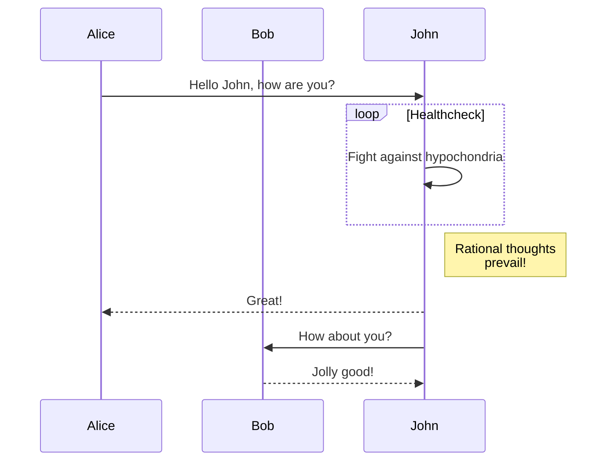

# GitBook Guidelines

This document provides a comprehensive reference for all available components and formatting options when creating content for the Jekyll GitBook theme.

## Front Matter Configuration

Every markdown file should include YAML front matter at the top:

```yaml
---
title: Page Title
layout: post        # or 'home' for main pages
mermaid: true      # Enable if using Mermaid diagrams
toc: true          # Enable table of contents (optional)
---
```

### Available Layouts
- `post` - Standard content pages
- `home` - Homepage layout
- `search-base` - Search functionality

## Alert Blocks

The theme supports three types of styled alert blocks using Kramdown attributes:

### Tip Block
```markdown
> ##### TIP
>
> This is a helpful tip for readers. Use this for suggestions,
> best practices, or useful information.
{: .block-tip }
```

### Warning Block
```markdown
> ##### WARNING
>
> This is a warning message. Use this to alert readers about
> important considerations or potential issues.
{: .block-warning }
```

### Danger Block
```markdown
> ##### DANGER
>
> This is a danger/error message. Use this for critical information
> that could cause problems if ignored.
{: .block-danger }
```

## Mathematical Expressions

The theme supports MathJax for rendering LaTeX mathematical expressions.

### Inline Math
Use single dollar signs for inline expressions:
```markdown
The Pythagorean theorem is $x^2 + y^2 = z^2$.
```

### Display Math
Use double dollar signs for block equations:
```markdown
$$x = {-b \pm \sqrt{b^2-4ac} \over 2a}$$
```

### Complex Expressions
```markdown
Fermat's Last Theorem states that no three positive integers $a$, $b$, and $c$ 
satisfy the equation $a^n + b^n = c^n$ for any integer value of $n$ greater than 2.

$$a^n + b^n = c^n \quad \text{where } n > 2$$
```

## Diagrams with Mermaid.js

Enable Mermaid diagrams by adding `mermaid: true` to your front matter.

### Graph Diagrams
```markdown

```

### Sequence Diagrams
```markdown

```

### Alternative HTML Method
For embedding Mermaid diagrams in HTML:
```html
<div class="language-mermaid">
    graph TD;
        A-->B;
        A-->C;
        B-->D;
        C-->D;
</div>
```

## Footnotes

Use square bracket notation with caret for footnote references:

```markdown
This statement needs a citation[^1].

[^1]: Reference source goes here
```

## Table of Contents (TOC)

Configure TOC in your `_config.yml`:
```yaml
toc:
  enabled: true
  h_min: 1          # Minimum heading level
  h_max: 3          # Maximum heading level
```

Or enable per-page in front matter:
```yaml
---
toc: true
---
```

## Code Blocks

### Syntax Highlighting
```markdown
```python
def hello_world():
    print("Hello, World!")
```
```

### Inline Code
Use backticks for `inline code` within paragraphs.

## Basic Formatting

### Headers
```markdown
# H1 Header
## H2 Header  
### H3 Header
#### H4 Header
##### H5 Header
###### H6 Header
```

### Lists

#### Unordered Lists
```markdown
- Item 1
- Item 2
  - Nested item
  - Another nested item
- Item 3
```

#### Ordered Lists
```markdown
1. First item
2. Second item
   1. Nested item
   2. Another nested item
3. Third item
```

### Tables
```markdown
| Column 1 | Column 2 | Column 3 |
|----------|----------|----------|
| Data 1   | Data 2   | Data 3   |
| Data 4   | Data 5   | Data 6   |
```

### Emphasis
```markdown
*Italic text* or _italic text_
**Bold text** or __bold text__
***Bold and italic*** or ___bold and italic___
```

### Links and Images
```markdown
[Link text](https://example.com)

```

## Page Configuration Options

### Cover Images
Add a cover image to your page:
```yaml
---
cover: path/to/cover-image.jpg
---
```

### Analytics Integration
Configure in `_config.yml`:
```yaml
google_analytics: UA-XXXXXXXX-X
```

## Best Practices

### Content Structure
- Always include a meaningful title in front matter
- Use descriptive headings to create clear document structure
- Never add titles like `# Welcome` as the title is defined in front matter
- Organize content with proper heading hierarchy (H1 > H2 > H3)

### Component Usage
- Enable Mermaid only when needed (`mermaid: true` in front matter)
- Use appropriate alert blocks for different message types
- Keep mathematical expressions simple and readable
- Test footnote references work correctly

### File Organization
- Place markdown files in appropriate collections (`_posts`, `_pages`, `_others`)
- Use meaningful file names that reflect content
- Include proper permalinks in front matter if needed

### Performance
- Optimize images before embedding
- Use Mermaid diagrams judiciously (they require additional JavaScript)
- Keep mathematical expressions concise for faster rendering

## Reference Links

- [Jekyll GitBook Theme](https://sighingnow.github.io/jekyll-gitbook/)
- [MathJax Documentation](https://docs.mathjax.org/en/latest/index.html)  
- [Mermaid.js Documentation](https://mermaid.js.org/)
- [Kramdown Syntax](https://kramdown.gettalong.org/syntax.html)